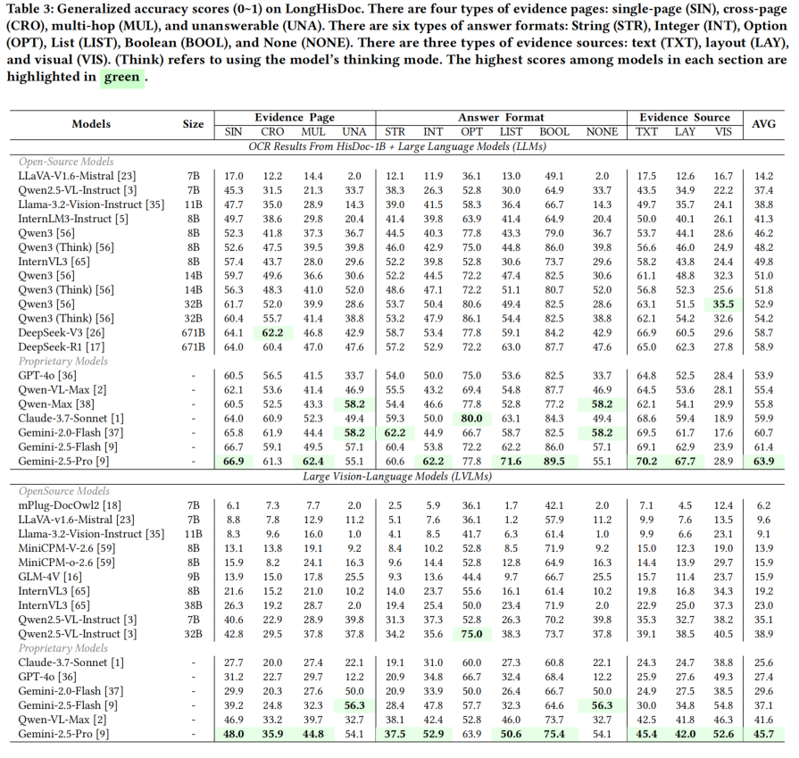

# LongHisDoc: A Benchmark for Long-context Historical Document Understanding


## 📖 Introduction
We present **LongHisDoc**, a pioneering benchmark specifically designed to evaluate the capabilities of LLMs and LVLMs in long-context historical document understanding tasks. This benchmark includes 101 historical documents across 10 categories, with 1,012 expert-annotated question-answer pairs covering four types, and the evidence for the questions is drawn from three modalities. 

* The Q&A pairs are provided in json format (LongHisDoc.json) and contain the following attributes:
```
{
            "doc_id": "9242",
            "question": "成公三年，诸侯伐郑，军队驻扎在哪里？",
            "answer": "伯牛",
            "evidence_pages": "[3]",
            "type": "Single Page",
            "answer_type": "Str",
            "evidence_modal": "layout",
            "input_pages": "[1, 2, 3, 4, 5, 6, 7, 8, 9, 10, 11, 12, 13, 14, 15, 16, 17, 18, 19, 20, 21, 22, 23, 24, 25, 26, 27, 28, 29, 30]",
            "item_id": "9242_1",
            "book_name": "《01/24音註全文春秋括例始末左伝句読直解著者林堯叟（宋）／訓点者松永昌易[数量]25冊[書誌事項]刊本,寛文01年[旧蔵者]昌平坂学問所/M2015073110264263265_0001》",
            "guji_type_zh": "史藏",
            "guji_type_en": "History"
  }
```
## 🛠️ Installation

* To begin, please download the dataset from [LongHisDoc Data](https://huggingface.co/datasets/qweq12433454/LongHisDoc).

* Clone this repo.

* Install the required packages:
```bash
pip install -r requirements.txt
```
## 🔎 Evaluation

* Our evaluation pipeline consists of three stages: *response generation*, *answer extraction*, and *score calculation*. The corresponding code for each stage can be found in their respective directories.

#### A. Response Generation
You can find all inference code of the models in folder *response_generation*.
#### Open-source Model
For open-source models, we perform inference locally. After modifying the model path in the file to your own paths, you can start model inference. Taking the experimental setup with image input for Qwen2.5-VL as an example.

```bash
CUDA_VISIBLE_DEVICES=0 python response_generation/qwen2_5-vl-img.py --model_path './path/to/your/model'
```

#### API Model
For some closed-source models or large-scale open-source models, we perform inference by calling their APIs. After setting the API URL, API key, and output file path, you can start model inference. Taking the experimental setup with image input for GPT-4o as an example.

```bash
python response_generation/gpt-4o-img.py
```

Once the inference is completed, you will obtain a JSON file with the same format as *LongHisDoc.json*, but with an additional key named *"model_res"*.

#### B. Answer Extraction
After obtaining the model output, we use GPT-4o to extract the final answer. You need to set the path to the model inference results and the path to final answer in the Python file. Then run the code.

```bash
python answer_extraction/LLM_extract_multiple_gpt-4o.py
```

Once the code completes, you will obtain a JSON file with the same format as the input model output, but with an additional key named "LLM_extracted".

#### C. Score Calculation
After obtaining the extracted ANSWER, we can run the following code to compute the scores.


```bash
python score_calculation/compute_infer_acc_score.py
```

The model scores are recorded in an Excel (.xlsx) file.

#### Evaluation of the retrieverS
* It needs to use the corresponding code in retriever_infer for inference, and then the score calculation needs to be done using score_calculation/compute_retriever_recall_score.py.

## 📊 Evaluation Result


## 📜 License
The data should be used and distributed under [ (CC BY-NC-ND 4.0)](https://creativecommons.org/licenses/by-nc-nd/4.0/deed.zh-hans) for non-commercial research purposes.
